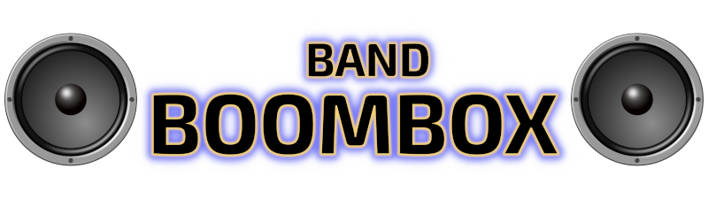

# Band BoomBox

Band BoomBox is a free, open source rhythm game built using the Unity engine. The main gameplay involves players hitting a sequence of notes as accurately as possible in order to earn points. The game can be played with either a keyboard or a controller, and features both local and networked cooperative multiplayer.

## Features
- Completely free (as in "Open Source Freedom", not "Free To Play but Pay To Win")
- Playable on Windows, or Linux (including Steam Deck)
- Support for playing with either a controller or a keyboard
- Local multiplayer for up to 6 players
- Experimental LAN (network) multiplayer for 8+ players
- Full support for custom songs, complete with a built in editor
  
## Recommended System Requirements
- OS: Windows 10 or later, OR Ubuntu Linux 22.04 or later, OR SteamOS 3.4 or later
  - Note: There are likely many other Linux distros that can run Band BoomBox without issue. Feel free to experiment, but those are not officially supported.
- CPU: Intel Core i5 6600K
- RAM: 8GB (Mainly for the OS itself, not the game. Band BoomBox actively uses around 512 MB of RAM)
- GPU: Nvidia GeForce GTX 960
  - Note: Many newer integrated GPUs will be able to run Band BoomBox with decent performance, but having a discrete one is recommended for higher resolutions, frame rates and frame pacing consistency.
- Display: 16:9 Aspect Ratio display recommended, with a minimum resolution of 1280x720 (720p). The game will run on other aspect ratios, but this may result in a stretched image.
- HDD: At least 500 MB of free space
- One XInput compatible controller per player (alternatively, one player can play using a keyboard)

## Controls
### Keyboard

<table>
<tr>
    <td> </td>
  <td>S</td>
      <td> </td>
    <td>Down / Numpad 2</td>
  <td colspan="2">(Expert Difficulty Only)</td>
</tr>
  <tr>
    <td> </td>
      <td>D</td>
        <td> </td>
           <td>Right / Numpad 6</td>
          <td> </td>
    <td>Q</td>

  </tr>
  <tr>
    <td> </td>
      <td>A</td>
        <td> </td>
      <td>Left / Numpad 4</td>
            <td> </td>
      <td>Numpad 7</td>
  </tr>
  <tr>
        <td> </td>
      <td>W</td>
        <td> </td>
      <td>Up / Numpad 8</td>
  </tr>

<tr>
      <td> </td>
    <td>Any of the above</td>
      <td> </td>
    <td>Any of the above</td>
</tr>
<tr>
      <td>Start / Pause </td>
    <td>Enter</td>
      <td>Turbo</td>
    <td>Space</td>
</tr>
</table>

### Controller

## Songs
The current version of Band BoomBox includes three playable songs. More songs can be added by using the built-in editor to import audio files (.mp3, .ogg and .flac formats are supported), then composing note sequences for them (called Charts).

## Development
Compiling Band BoomBox requires the following tools:

- Unity 2022.3 LTS, which can be downloaded from here: https://unity.com/releases/editor/qa/lts-releases . The free Unity Personal Edition will suffice, but note that this will require a free Unity account.
- A suitable C# IDE, such as the latest version of Visual Studio or Visual Studio Code. If using Visual Studio, ensure that the "Game development with Unity" component is installed. The free Community Edition will suffice.

Once the above are installed, do the following:

- Clone the source code using your preferred git client. 
- Open Unity Hub, and add the game to the Projects list by selecting the folder that the source code was cloned into.
- Open the project in the Unity Editor by selecting it from the Projects list in Unity Hub.
- Once Band BoomBox is open in the Unity Editor, it should not require any special configuration to compile. To run the game, click on the "Play" button at the top of the Editor window.
- To compile the game into a standalone executable, select File -> Build Settings, select your preferred platform, and click on "Build".

To build the project using the command line instead, try using the `Build.ps1` Powershell script, located in the project's root folder. Usage:

    ./Build.ps1 -OutputPath "D:\Projects\Band BoomBox\Build"

Note that building the Linux version of the game does **not** require a Linux machine. It can be compiled on Windows, provided that the appropriate toolchain components are installed. The above build script will attempt to compile for both Windows and Linux.

## Contributing
Contributions to fix bugs or add features are welcome, as are contributions to provide additional songs to the game. If you are interested, please submit a Pull Request. Note that all contributions must be compatible with the MIT licence.
