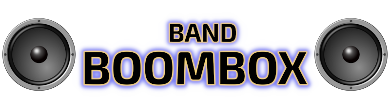

# Band BoomBox

Band BoomBox is a free, open source rhythm game built using the Unity engine. The main gameplay involves players hitting a sequence of notes as accurately as possible in order to earn points. The game can be played with either a keyboard or a controller, and features both local and networked cooperative multiplayer.

## Features
- Completely free (as in "Open Source Freedom", not "Free To Play but Pay To Win")
- Playable on Windows, or Linux (including Steam Deck)
- Support for playing with either a controller or a keyboard
- Single player, as well as local multiplayer for up to 6 players
- Experimental LAN (network) multiplayer for 8+ players
- Full support for custom songs, complete with a built in editor

## Getting Started
To download the game, simply head to the Releases list, displayed on the right of this page, and download either the Windows or Linux version of the game, depending on which operating system you're using. It is recommended to download the Official Song Collection as well, as these are offered as a separate download alongside the game itself.

## Recommended System Requirements
- OS: Windows 10 or later, OR Ubuntu Linux 22.04 or later, OR SteamOS 3.4 or later
  - Note: There are likely many other Linux distros that can run Band BoomBox without issue. Feel free to experiment, but those are not officially supported.
- CPU: Intel Core i5 6600K
- RAM: 8GB (Mainly for the OS itself, not the game. Band BoomBox actively uses around 512 MB of RAM)
- GPU: Nvidia GeForce GTX 960
  - Note: Many newer integrated GPUs will be able to run Band BoomBox with decent performance, but having a discrete one is recommended for higher resolutions, frame rates and frame pacing consistency.
- Display: 16:9 Aspect Ratio display recommended, with a minimum resolution of 1280x720 (720p). The game will run on other aspect ratios, but this may result in a stretched image.
- HDD: At least 500 MB of free space
- One XInput compatible controller per player (alternatively, one player can play using a keyboard)

## Controls
### Keyboard

<table>
<tr>
    <td> </td>
  <td>S</td>
      <td> </td>
    <td>Down / Numpad 2</td>
  <td colspan="2">(Expert Difficulty Only)</td>
</tr>
  <tr>
    <td> </td>
      <td>D</td>
        <td> </td>
           <td>Right / Numpad 6</td>
          <td> </td>
    <td>Q</td>

  </tr>
  <tr>
    <td> </td>
      <td>A</td>
        <td> </td>
      <td>Left / Numpad 4</td>
            <td> </td>
      <td>Numpad 7</td>
  </tr>
  <tr>
        <td> </td>
      <td>W</td>
        <td> </td>
      <td>Up / Numpad 8</td>
  </tr>

<tr>
      <td> </td>
    <td>Any of the above</td>
      <td> </td>
    <td>Any of the above</td>
</tr>
<tr>
      <td>Start / Pause </td>
    <td>Enter</td>
      <td>Turbo</td>
    <td>Space</td>
</tr>
</table>

### Controller

## Songs
The current version of Band BoomBox includes more than ten playable songs, each with multiple difficulty levels catering to players of any skill level. In addition to this, the game also features a full built-in editor, allowing interested players to create their own. For more details on how to do this, please check the relevant pages on the Wiki.

**Note:** To reduce download sizes, the Official Song Collection is offered as a separate download from the game itself. For instructions on how to install songs, please see the [Getting Started page](https://github.com/thomeval/BandBoomBox/wiki/GettingStarted).

## Contributing
Contributions to fix bugs or add features are welcome, as are contributions to provide additional songs to the game. If you are interested, please submit a Pull Request on Github.

For details on how to set up a development environment that can compile the game, please see [this page](https://github.com/thomeval/BandBoomBox/wiki/Development).
